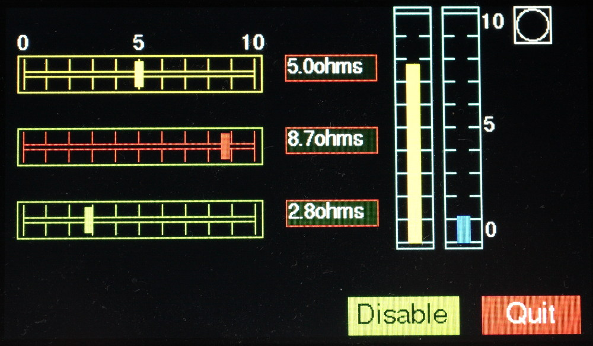

# Using large displays with MicroPython devices

There is an existing solution for displays based on the SSD1963 controller and
XPT2046 touch controller. This [detailed here](https://github.com/peterhinch/micropython-tft-gui),
uses a parallel interface. This interface combined with the highly optimised
device driver written by Robert Hammelrath, delivers very high performance at
the cost of requiring a large number of interface pins. It is STM (e.g. Pyboard)
specific.

This repository offers an alternative for displays based on the RA8875
controller. The driver configures this to use SPI to reduce the pin count to
five. The driver and GUI should be portable to any MicroPython target which
supports the `@micropython.viper` decorator.

There is a performance cost in using SPI, notably in the rendering of text. In
the context of the GUI and typical machine control and sensor display
applications, visual performance in handling updates is good. When drawing a
complete screen there is a visible lag notably on text-heavy screens.

The GUI is targeted at hardware control and sensor display applications. GUI
objects are drawn using graphics primitives rather than by rendering bitmap
images. This takes advantage of the RA8875 hardware rendering of graphics
primitives and ensures that controls are scalable. The API is via event driven
callbacks.

The GUI uses `uasyncio` for scheduling and has been tested on Pyboard V1.1 and
on Pyboard D. Supported hardware from Adafruit:

[Controller board](https://www.adafruit.com/product/1590)  
[4.3 inch display](https://www.adafruit.com/product/1591)  
[7 inch display](https://www.adafruit.com/product/2354)

Non-Adafruit display hardware may or may not work: the detailed hardware
specifications for displays may vary, requiring corresponding changes to the
device driver code. I am unlikely to be able to support this.

Most GUI users will require only the [GUI document](docs/GUI.md).

Device driver documentation is [here](docs/DRIVER.md). A sample image:

[Further images](./docs/IMAGES.md)
