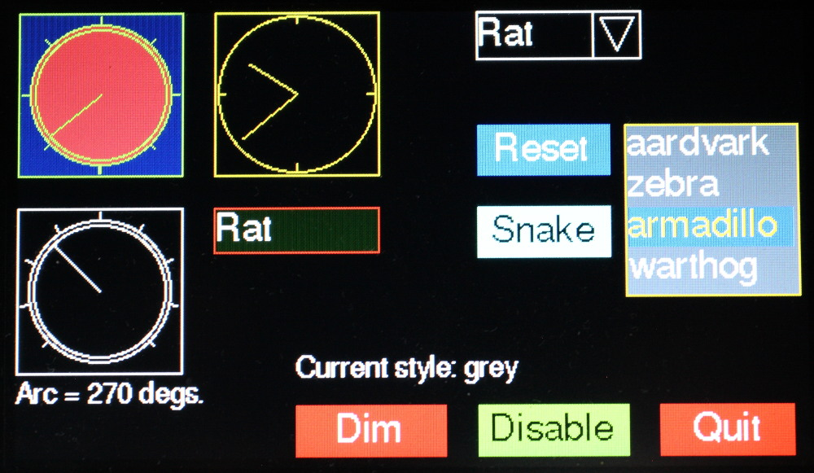

# RA8875 GUI

V0.17 Beta 31st Aug 2019.

Provides a simple event driven touch GUI interface for MicroPython targets used
with RA8875 based colour displays. It uses `uasyncio` for scheduling. It has
been tested with Pyboard 1.1 and with Pyboard D series with a 4.3 inch Adafruit
display. It is designed also to work with the 7 inch display but to date this
has not been tested.

It should work with most targets supporting the Viper code generator. Currently
this excludes ESP32. RAM limitations mean it is unlikely to work on ESP8266.



This shows some of the widgets provided. Further images may be seen
[here](./IMAGES.md). Color rendition in the image is not good: in practice
colors are clear and vibrant.

The library uses arbitrary fonts converted from `ttf` or `otf` formats using
[font_to_py.py](https://github.com/peterhinch/micropython-font-to-py.git). Two
sample fonts are provided.

An extension for plotting simple graphs is provided and is described
[here](./LPLOT.md).

### V0.16 Refactor

Widgets are implemented as modules in the `widgets` directory. This reduces RAM
usage: the application only imports widgets that it uses. The structure enables
the addition of new widgets without the need to change the core GUI module and
without increasing the RAM usage of existing applications.

# Contents

1. [Getting started](./GUI.md#1-getting-started)  
  1.1 [Installation](./GUI.md#11-installation)  
  1.2 [Calibration](./GUI.md#12-calibration)  
  1.3 [Demo scripts](./GUI.md#13-demo-scripts)  
  1.4 [A minimal code example](./GUI.md#14-a-minimal-code-example)  
2. [Concepts](./GUI.md#2-concepts)  
  2.1 [Terminology](./GUI.md#21-terminology)  
  2.2 [Coordinates](./GUI.md#22-coordinates)  
  2.3 [Colors](./GUI.md#23-colors)  
  2.4 [Callbacks](./GUI.md#24-callbacks)  
  2.5 [Screens](./GUI.md#25-screens)  
3. [Program Structure](./GUI.md#3-program-structure)  
  3.1 [Initialisation](./GUI.md#31-initialisation)  
4. [Class Screen](./GUI.md#4-class-screen)  
5. [Display Classes](./GUI.md#5-display-classes)  
  5.1 [Class Label](./GUI.md#51-class-label)  
  5.2 [Class Textbox](./GUI.md#52-class-textbox)  
  5.3 [Class Dial](./GUI.md#53-class-dial)  
  5.4 [Class LED](./GUI.md#54-class-led)  
  5.5 [Class Meter](./GUI.md#55-class-meter)  
  5.6 [Vector display](./GUI.md#56-vector-display)  
6. [Control Classes](./GUI.md#6-control-classes)  
  6.1 [Class Slider](./GUI.md#61-class-slider)  
  6.2 [Class Knob](./GUI.md#62-class-knob)  
  6.3 [Class Checkbox](./GUI.md#63-class-checkbox)  
  6.4 [Class Button](./GUI.md#64-class-button)  
  6.5 [Class ButtonList: emulate a button with multiple states](./GUI.md#65-class-buttonlist-emulate-a-button-with-multiple-states)  
  6.6 [Class RadioButtons](./GUI.md#66-class-radiobuttons)  
  6.7 [Class Listbox](./GUI.md#67-class-listbox)  
  6.8 [Class Dropdown](./GUI.md#68-class-dropdown)  
7. [Dialog Boxes](./GUI.md#7-dialog-boxes)  
  7.1 [Class Aperture](./GUI.md#71-class-aperture)  
  7.2 [Class DialogBox](./GUI.md#72-class-dialogbox)  
8. [Fonts](./GUI.md#8-fonts)  
9. [Memory issues](./GUI.md#9-memory-issues)  
10. [RA8875 issues](./GUI.md#10-ra8875-issues)  
11. [References](./GUI.md#11-references)  

# 1. Getting started

The GUI requires `uasyncio`. On many platforms this is pre-installed. At the
REPL issue
```python
import uasyncio
```
If an `ImportError` occurs you will need to install it. Instructions may be
found [here](https://github.com/peterhinch/micropython-async/blob/master/TUTORIAL.md).

## 1.1 Installation

### Hardware

The table below is based on the use of a Pyboard 1.x or Pyboard D. The board is
assumed to be powered by USB or from a source of no more than 5V. With the
supplied software the
[Adafruit RA8875 adaptor](https://www.adafruit.com/product/1590) may be wired
as follows:

| Pyboard | RA8875  |
|:-------:|:-------:|
| Vin     | VIN     |
| GND     | GND     |
| X4      | RST     |
| X5      | CS      |
| Y6      | SCK     |
| Y7      | MISO    |
| Y8      | MOSI    |

Pins are arbitrary and may be redefined e.g. for non-pyboard targets. The
`tft_local.py` file must be amended to suit as described below. Use of software
SPI may incur a performance penalty. The Adafruit adaptor must be powered from
a voltage in the range 3-5V nominal.

Note from the Adafruit documentation: "The RA8875 does not tri-state the MISO
pin, it should not share that pin with any other SPI device (including an SD
card reader) without the use of a 74HC125 or similar."

### Software

Installation consists of cloning the repo to a PC and copying the directory
tree to the target hardware. The `docs` subdirectory, `README.md` and
`LICENSE.md` may be omitted to conserve space. For example, using the
[rshell utility](https://github.com/dhylands/rshell) and assuming a Pyboard
whose filesystem is under `/flash`:
```
$ git clone https://github.com/peterhinch/micropython_ra8875.git
$ rm -r micropython_ra8875/docs
$ rm micropython_ra8875/README.md
$ rm micropython_ra8875/LICENSE.md
$ rshell cp -r micropython_ra8875/ /flash
```

### Testing

The calibration procedure below provides confirmation of correct wiring and
functional hardware.

## 1.2 Calibration

The touch panel requires calibration to achieve sufficient accuracy for the GUI.
This is done by issuing:
```python
>>> import micropython_ra8875.driver.cal
```
The top left and bottom right corners of the visible screen should be
identified by yellow lines. If this does not occur, check your `tft_local.py`
file for the correct pin numbers and display size; check your wiring.

Using a stylus for accuracy, touch the intersection of the top left lines.
Repeat for the bottom right corner. The REPL will show the coordinates read by
the device. The last values read for each corner will be retained. Quit the
program with `ctrl-c`: it will ask if you want to keep these readings. If you
confirm the data will be stored on the target (in the file `tft_local.py`).

It is suggested that you then run one or more of the demos. Hit `ctrl-d` to
reset the board and issue (for example):
```python
>>> import micropython_ra8875.demos.hst
```
Other demos are listed below.

Depending on the target you may get a memory error. This indicates that the
target has too little RAM to compile `ugui.py`. See
[section 9](./GUI.md#9-memory-issues) for solutions to this.

###### [Jump to Contents](./GUI.md#contents)

## 1.3 Demo scripts

These are run at the REPL by issuing a `ctrl-d` soft reset, then importing them
e.g.
```python
import micropython_ra8875.demos.vst
```
 1. `vst.py` A test program for vertical linear sliders. Also demos an
 asynchronous coroutine and linked sliders.
 2. `hst.py` Tests horizontal slider controls, meter and LED. Demos
 asynchronous coroutine, linked sliders and dynamically changing object colors.
 3. `buttontest.py` Pushbuttons, radio buttons, highlighting buttons and
 checkboxes. "Reset" buttons respond to short and long presses.
 4. `knobtest.py` Rotary controls, dropdown lists and listboxes. Shows the two
 styles of "greying out" of disabled controls.
 5. `screentest.py` Screen changes: demonstrates refresh of a screen when an
 overlaying screen quits.
 6. `dialog.py` Modal dialog boxes.
 7. `pt.py` Plot test.
 8. `ktif.py` A demo using internal and external fonts.
 9. `vtest.py` Uses `VectorDial` instances for analog clock and compass style
 displays.
 10. `tbox.py` Demo of the `Textbox` control.

## 1.4 A minimal code example

This illustrates the "hello world" of the GUI:
```python
from micropython_ra8875.ugui import Screen
from micropython_ra8875.support.constants import *
from micropython_ra8875.widgets.buttons import Button
from micropython_ra8875.fonts import font10
from micropython_ra8875.tft_local import setup

def quitbutton():
    def quit(button):
        Screen.shutdown()
    Button((109, 107), font = font10, callback = quit, fgcolor = RED,
           text = 'Quit', shape = RECTANGLE)

class BaseScreen(Screen):
    def __init__(self):
        super().__init__()
        quitbutton()
setup()
Screen.change(BaseScreen)
```

###### [Jump to Contents](./GUI.md#contents)

# 2. Concepts

Familiarity with callbacks and event driven programming will assist in
developing applications.

## 2.1 Terminology

Widgets are created on a `Screen` instance which normally fills the entire
physical screen. Widgets are either `control` or `display` objects. The former
can respond to touch (e.g. `Pushbutton` instances) while the latter cannot
(e.g. `LED` or `Dial` instances).

## 2.2 Coordinates

In common with most displays, the top left hand corner of the display is (0, 0)
with increasing values of x to the right, and increasing values of y downward.
Display objects exist within a rectangular bounding box; in the case of touch
sensitive controls this corresponds to the sensitive region. Locations are
defined as a 2-tuple (x, y). The location of an object is defined as the
location of the top left hand corner of the bounding box.

## 2.3 Colors

These are defined as a 3-tuple (r, g, b) with values of red, green and blue in
range 0 to 255. The interface and this document uses the American spelling
(color) throughout. This is for historical reasons.

## 2.4 Callbacks

The interface is event driven. Controls may have optional callbacks which will
be executed when a given event occurs. A callback function receives positional
arguments. The first is a reference to the object raising the callback.
Subsequent arguments are user defined, and are specified as a tuple or list of
items. Callbacks are optional, as are the argument lists - a default null
function and empty list are provided. Callbacks are typically written as bound
methods - see the Screens section for a reason why this is useful.

When writing callbacks take care to ensure that the number of arguments passed
is correct, bearing in mind the first arg listed above. Failure to do this will
result in tracebacks which implicate the GUI code rather than the buggy user
code: this is because the GUI runs the callbacks.

All controls and displays have a `tft` property which is the `TFT` instance.
This enables callbacks to access the driver's graphics primitives.

## 2.5 Screens

GUI controls and displays are rendered on a `Screen` instance. A user program
may instantiate multiple screens, each with its own set of GUI objects. The
`Screen` class has class methods enabling runtime changes of the screen to be
rendered to the physical display. This enables nested screens. The feature is
demonstrated in `screentest.py`.

Applications should be designed with a `Screen` subclass for each of the
application's screens (even if the app uses only a single screen). This
facilitates sharing data between GUI objects on a screen, and simplifies the
handling of control callbacks. These will be methods bound to the user screen.
They can access the screen's bound variables via `self` and the control's
bound methods via the callback's first argument (which is a reference to the
control). Again `screentest.py` provides examples.

The `Screen` class has 3 null methods which may be implemented in subclasses:
`on_open` which runs when a screen is opened but prior to its display,
`after_open` which is called after display, and `on_hide` which runs when a
screen change is about to make the screen disappear. These may be used to
instantiate or control `uasyncio` tasks and to retrieve the results from a
modal dialog box.

The `Screen` class is configured in `tft_local.py`.

###### [Jump to Contents](./GUI.md#contents)

# 3. Program Structure

The following illustrates the structure of a minimal program:
```python
from micropython_ra8875.ugui import Screen
from micropython_ra8875.support.constants import *
from micropython_ra8875.widgets.buttons import Button
from micropython_ra8875.fonts import font10
from micropython_ra8875.tft_local import setup

def quitbutton():
    def quit(button):
        Screen.shutdown()
    Button((109, 107), font = font10, callback = quit, fgcolor = RED,
           text = 'Quit', shape = RECTANGLE)

class BaseScreen(Screen):
    def __init__(self):
        super().__init__()
        quitbutton()
setup()
Screen.change(BaseScreen)
```

The last line causes the Screen class to instantiate your `BaseScreen` and to
start the scheduler using that screen object. Control then passes to the
scheduler: any code following this line will not run until the GUI is shut down
and the scheduler is stopped (`Screen.shutdown()`).

If the `uasyncio` event loop is to be instantiated with non-default arguments
this should be done before calling `setup`.

## 3.1 Initialisation

This is performed by `tft_local.py` which instantiates a `TFT` display. The
`TFT` class is derived from the driver's `RA8875` class. These are documented
[here](./DRIVER.md).

###### [Jump to Contents](./GUI.md#contents)

# 4. Class Screen

The `Screen` class presents a full-screen canvas onto which displayable
objects are rendered. Before instantiating GUI objects a `Screen` instance
must be created. This will be current until another is instantiated. When a GUI
object is instantiated it is associated with the current screen.

The best way to use the GUI, even in single screen programs, is to create a
user screen by subclassing the `Screen` class. GUI objects are instantiated
in the constructor. This arrangement facilitates communication between objects
on the screen. The following presents an outline of this approach:

```python
from micropython_ra8875.ugui import Screen
from micropython_ra8875.support.constants import *
from micropython_ra8875.widgets.buttons import Button
from micropython_ra8875.widgets.label import Label
from micropython_ra8875.fonts import font10
from micropython_ra8875.tft_local import setup

def backbutton(x, y):
    def back(button):  # A callback defined locally
        Screen.back()
    Button((x, y), font = font10, fontcolor = BLACK, callback = back,
           fgcolor = CYAN,  text = 'Back')

def fwdbutton(x, y, cls_screen, text='Next'):
    def fwd(button):
        Screen.change(cls_screen)
    Button((x, y), font = font10, callback = fwd, fgcolor = RED, text = text)

def quitbutton():
    def quit(button):
        Screen.shutdown()
    Button((109, 107), font = font10, callback = quit, fgcolor = RED, text = 'Quit')

class Screen_1(Screen):
    def __init__(self):
        super().__init__()
        Label((0, 0), font = font10, value = 'Test screen 1')
        backbutton(0, 100)

class Screen_0(Screen):
    def __init__(self):
        super().__init__()
        Label((0, 0), font = font10, value = 'Test screen 0')
        fwdbutton(0, 107, Screen_1)
        quitbutton()
setup()
Screen.change(Screen_0)
```

Note that the GUI is started by issuing `Screen.change` with the class as its
argument rather than an instance. This aims to minimise RAM usage.

## 4.1 Class methods

In normal use the following methods only are required:  
 * `change` Change screen, refreshing the display. Mandatory positional
 argument: the new screen class name. This must be a class subclassed from
 `Screen`. The class will be instantiated and displayed. Optional keyword
 arguments: `args`, `kwargs`. These enable passing positional and keyword
 arguments to the constructor of the new screen.
 * `back` Restore previous screen.
 * `shutdown` Clear the screen and shut down the GUI.
 * `set_grey_style` Sets the way in which disabled ('greyed-out') objects are
 displayed. The colors of disabled objects are dimmed by a factor and
 optionally desaturated (turned to shades of grey). Optional keyword arguments:
 `desaturate` default `True` and `factor` default 2. A `ValueError`
 will result if `factor` is <= 1. The default style is to desaturate and dim
 by a factor of 2.

Class variable:  
 * `tft` Returns the `TFT` instance. This instance allows direct drawing to the
 physical screen. The `TFT` class provides access to graphics primitives and is
 documented [here](./DRIVER.md). Anything so drawn will be lost when the screen
 is changed. 

See `demos/pt.py` and `demos/screentest.py` for examples of multi-screen
design.

## 4.2 Constructor

This takes no arguments.

## 4.3 Callback Methods

These are null functions which may be redefined in user subclasses.

 * `on_open` Called when a screen is instantiated but prior to display.
 * `after_open` Called after a screen has been displayed.
 * `on_hide` Called when a screen ceases to be current.

###### [Jump to Contents](./GUI.md#contents)

# 5. Display Classes

These classes provide ways to display data and are not touch sensitive.

## 5.1 Class Label

Displays a single line of text in a fixed length field. The height of a label
is determined by the metrics of the specified font.
```python
from micropython_ra8875.widgets.label import Label
```

Constructor mandatory positional argument:
 1. `location` 2-tuple defining position.

Keyword only arguments:  
 * `font` Mandatory. Font object to use.
 * `width` The width of the object in pixels. Default: `None` - width is
 determined from the dimensions of the initial text.
 * `border` Border width in pixels - typically 2. If omitted, no border will
 be drawn.
 * `fgcolor` Color of border. Defaults to system color.
 * `bgcolor` Background color of object. Defaults to system background.
 * `fontcolor` Text color. Defaults to system text color.
 * `value` Initial text. Default: `None`.

Method:
 * `value` Argument `val` string, default `None`. If provided, refreshes
 the label with the passed text otherwise clears the text in the label.

###### [Jump to Contents](./GUI.md#contents)

## 5.2 Class Textbox

Displays multiple lines of text in a field of fixed dimensions. Text may be
clipped to the width of the control or may be word-wrapped. If the number of
lines of text exceeds the height available, scrolling may be performed, either
by calling a method or by touching the control.

Works with fixed and variable pitch fonts. Tab characters are supported for
Python fonts (not for the RA8875 internal font).
```python
from micropython_ra8875.ugui.widgets.textbox import Textbox
```

Constructor mandatory positional arguments:
 1. `location` 2-tuple defining position.
 2. `width` Width of the object in pixels.
 3. `nlines` Number of lines of text to display. The object's height is
 determined from the height of the font:  
 `height in pixels = nlines*font_height + 2*border`
 4. `font` Font to use. The internal font `IFONT16` renders faster than the
 Python fonts.

Keyword only arguments:
 * `border=2` Border width in pixels - typically 2. If `None`, no border will
 be drawn.
 * `fgcolor=None` Color of border. Defaults to system color.
 * `bgcolor=None` Background color of object. Defaults to system background.
 * `fontcolor=None` Text color. Defaults to system text color.
 * `clip=True` By default lines too long to display are right clipped. If
 `False` is passed, word-wrap is attempted. If the line contains no spaces
 it will be wrapped at the right edge of the window.
 * `repeat=True` Controls the behaviour of touch-based scrolling. By default
 a long press causes repeated scrolling. `False` requires a discrete press for
 each line movement.
 * `tab=32` Tab space in pixels.

Methods:
 * `append` Args `s, ntrim=None, line=None` Append the string `s` to the
 display and scroll up as required to show it. By default only the number of
 lines which will fit on screen are retained. If an integer `ntrim=N` is
 passed, only the last N lines are retained. If an integer (typically 0) is
 passed in `line` the display will scroll to show that line.
 * `scroll` Arg `n` Number of lines to scroll. A negative number scrolls up. If
 scrolling would achieve nothing because there are no extra lines to display,
 nothing will happen.
 * `value` No args. Returns the number of lines of text stored in the widget.
 * `clear` No args. Clears all lines from the widget and refreshes the display.
 * `goto` Arg `line=None` Fast scroll to a line. By default shows the end of
 the text. 0 shows the start.

Fast updates:  
Rendering text to the screen is relatively slow. To send a large amount of text
the fastest way is to perform a single `append`. Text may contain newline
(`'\n'`) characters as required. In that way rendering occurs once only.

###### [Jump to Contents](./GUI.md#contents)

## 5.3 Class Dial

Displays scalar values in a circular dial. Values may be considered to be
angles in radians with zero appearing as a vertical pointer. Positive angles
appear as clockwise rotation of the pointer. The object can display multiple
angles using pointers of differing lengths (like a clock face).

See also the [vector display](./GUI.md#56-vector-display).
```python
from micropython_ra8875.widgets.dial import Dial
```
Constructor mandatory positional argument:
 1. `location` 2-tuple defining position.

Keyword only arguments (all optional):  
 * `height` Dimension of the square bounding box. Default 100 pixels.
 * `fgcolor` Foreground color. Defaults to system color.
 * `bgcolor` Background color of object. Defaults to system background.
 * `border` Border width in pixels - typically 2. If omitted, no border will
 be drawn.
 * `pointers` Tuple of floats in range 0 to 0.9. Defines the length of each
 pointer as a  proportion of the dial diameter. Default (0.9,) i.e. one pointer
 of length 0.9.
 * `ticks` Defines the number of graduations around the dial. Default 4.

Method:
 * `value` Arguments: `angle` (mandatory), `pointer` (optional) the
 pointer index. Displays  an angle. A `ValueError` will be raised if the
 pointer index exceeds the number of pointers defined by the constructor
 `pointers` argument.

###### [Jump to Contents](./GUI.md#contents)

## 5.4 Class LED

Displays a Boolean state. Can display other information by varying the color.
```python
from micropython_ra8875.widgets.led import LED
```

Constructor mandatory positional argument:
 1. `location` 2-tuple defining position.

Keyword only arguments (all optional):
 * `height` Dimension of the square bounding box. Default 30 pixels.
 * `fgcolor` Color of border. Defaults to system color.
 * `bgcolor` Background color of object. Defaults to system background.
 * `border` Border width in pixels - default 2. If `None`, no border will
 be drawn.
 * `color` The color of the LED. Default RED.

Methods:
 * `value` Argument `val` Boolean, default `None`. If provided, lights or
 extinguishes the LED. Always returns its current state.
 * `color` Argument `color`. Change the LED color without altering its
 state.

###### [Jump to Contents](./GUI.md#contents)

## 5.5 Class Meter

This displays a single value in range 0.0 to 1.0 on a vertical linear meter.
```python
from micropython_ra8875.widgets.meter import Meter
```

Constructor mandatory positional argument:
 1. `location` 2-tuple defining position.

Optional keyword only arguments:
 * `height` Dimension of the bounding box. Default 200 pixels.
 * `width` Dimension of the bounding box. Default 30 pixels.
 * `font` Font to use in any legends. Default: `None` No legends will be
 displayed.
 * `legends` A tuple of strings to display as `Label` instances to the right of
 the meter. They will appear equidistant along the vertical scale, with string
 0 at the bottom. Default `None`: no legends will be shown.
 * `divisions` Count of graduations on the meter scale. Default 10.
 * `fgcolor` Color of border. Defaults to system color.
 * `bgcolor` Background color of object. Defaults to system background.
 * `fontcolor` Text color. Defaults to system text color.
 * `barcolor` Color of meter bar. Defaults to `fgcolor`.
 * `cb_move` Callback function which runs when the value is changed
 programmatically. Default is a null function.
 * `cbm_args` A list/tuple of arguments for above callback. Default `[]`.
 * `value` Initial value to display. Default 0.

Methods:
 * `value` Optional argument `val`. If provided, refreshes the meter
 display with a new value. Range 0.0 to 1.0: out of range values will be
 constrained to full scale or 0. Always returns its current value.
 * `color` Mandatory arg `color` The meter's bar is rendered in the selected
 color. This supports dynamic color changes  

The callback receives an initial arg being the `Meter` instance followed by any
user supplied args. It can be a bound method, typically of a `Screen` subclass.
The CB runs before the update is processed, enabling dynamic color change. See
`demos/hst.py`.

###### [Jump to Contents](./GUI.md#contents)

## 5.6 Vector display

Provides a means of displaying one or more vectors. A vector is a `complex`
with magnitude in the range of 0 to 1.0. In use a `VectorDial` is instantiated,
followed by a `Pointer` instance for each vector to be displayed on it. The
`VectorDial` can display its vectors as lines (as on a clock face) or as arrows
(as on a compass).

By contrast with the `Dial` class the pointers have lengths and colors which
can vary dynamically.
```python
from micropython_ra8875.widgets.vectors import Pointer, VectorDial
```

### Class VectorDial

Constructor mandatory positional argument:
 1. `location` 2-tuple defining position.

Keyword only arguments (all optional):  
 * `height=100` Dimension of the square bounding box.
 * `fgcolor=None` Foreground color. Defaults to system color.
 * `bgcolor=None` Background color of object. Defaults to system background.
 * `border=None` Border width in pixels - typically 2. Default: no border.
 * `ticks=4` Defines the number of graduations around the dial.
 * `arrow=False` If `True` vectors will appear as arrows.
 * `pip=None` By default a small circular "pip" is drawn at the centre of the
 dial. If `False` is passed this is omitted. If a color is passed, it will be
 drawn using that color. If the shortest pointer has a length below a threshold
 the "pip" is omitted to ensure visibility.

### Class Pointer

Constructor mandatory positional arg:
 * `dial` The dial on which it is to be displayed.

Method:
 * `value` Args `v=None, col=None`. Returns the current value. If a `complex`
 is passed as the value `v` it is scaled to ensure its magnitude is <= 1 and
 the pointer is redrawn. If a color is passed as `col` the pointer's color is
 updated.

###### [Jump to Contents](./GUI.md#contents)

# 6. Control Classes

These classes provide touch-sensitive objects capable of both the display and
entry of data. If the user moves the control, its value will change and an
optional callback will be executed. If another control's callback or a
coroutine alters a control's value, its appearance will change accordingly.

## 6.1 Class Slider

These emulate linear potentiometers. Vertical `Slider` and horizontal
`HorizSlider` variants are available. These are constructed and used
similarly. The short forms (v) or (h) are used below to identify these
variants. See the note above on callbacks.
```python
from micropython_ra8875.widgets.sliders import Slider, HorizSlider
```

Constructor mandatory positional argument:
 1. `location` 2-tuple defining position.

Optional keyword only arguments:
 * `font` Font to use for any legends. Default `None`: no legends will be
 drawn.
 * `height` Dimension of the bounding box. Default 200 pixels (v), 30 (h).
 * `width` Dimension of the bounding box. Default 30 pixels (v), 200 (h).
 * `divisions` Number of graduations on the scale. Default 10.
 * `legends` A tuple of strings to display near the slider. These `Label`
 instances will be  distributed evenly along its length, starting at the bottom
 (v) or left (h).
 * `fgcolor` Color of foreground (the control itself). Defaults to system
 color.
 * `bgcolor` Background color of object. Defaults to system background.
 * `fontcolor` Text color. Defaults to system text color.
 * `slidecolor` Color for the slider. Defaults to the foreground color.
 * `border` Width of border. Default `None`: no border will be drawn. If a
 value (typically 2) is provided, a border line will be drawn around the
 control.
 * `cb_end` Callback function which will run when the user stops touching the
 control. Default is a null function.
 * `cbe_args` A list/tuple of arguments for above callback. Default `[]`.
 * `cb_move` Callback function which will run when the user moves the slider
 or the value is changed programmatically. Default is a null function.
 * `cbm_args` A list/tuple of arguments for above callback. Default `[]`.
 * `value` The initial value. Default 0.0: slider will be at the bottom (v),
 left (h).

Methods:
 * `greyed_out` Optional Boolean argument `val` default `None`. If
 `None` returns the current 'greyed out' status of the control. Otherwise
 enables or disables it, showing it in its new state.
 * `value` Optional arguments `val` (default `None`). If supplied the
 slider moves to reflect the new value and the `cb_move` callback is
 triggered. The method constrains the range to 0.0 to 1.0. Always returns the
 control's value.
 * `color` Mandatory arg `color` The control is rendered in the selected
 color. This supports dynamic color changes  

The callbacks receive an initial arg being the slider instance followed by any
user supplied args. They can be a bound methods, typically of a `Screen`
subclass. `cb_move` runs when the value changes but before the update is
processed, enabling dynamic color change. See `demos/hst.py`.

###### [Jump to Contents](./GUI.md#contents)

## 6.2 Class Knob

This emulates a rotary control capable of being rotated through a predefined
arc.
```python
from micropython_ra8875.widgets.knob import Knob
```

Constructor mandatory positional argument:
 1. `location` 2-tuple defining position.

Optional keyword only arguments:
 * `height` Dimension of the square bounding box. Default 100 pixels.
 * `arc` Amount of movement available. Default 2*PI radians (360 degrees).
 * `ticks` Number of graduations around the dial. Default 9.
 * `fgcolor` Color of foreground (the control itself). Defaults to system
 color.
 * `bgcolor` Background color of object. Defaults to system background.
 * `color` Fill color for the control knob. Default: no fill.
 * `border` Width of border. Default `None`: no border will be drawn. If a
 value (typically 2) is provided, a border line will be drawn around the
 control.
 * `cb_end` Callback function which will run when the user stops touching the
 control.
 * `cbe_args` A list/tuple of arguments for above callback. Default `[]`.
 * `cb_move` Callback function which will run when the user moves the knob or
 the value is changed.
 * `cbm_args` A list/tuple of arguments for above callback. Default `[]`.
 * `value` Initial value. Default 0.0: knob will be at its most
 counter-clockwise position.

Methods:
 * `greyed_out` Optional Boolean argument `val` default `None`. If
 `None` returns the current 'greyed out' status of the control. Otherwise
 enables or disables it, showing it in its new state.
 * `value` Optional argument `val`. If set, adjusts the pointer to
 correspond to the new value. The move callback will run. The method constrains
 the range to 0.0 to 1.0. Always returns the control's value.

###### [Jump to Contents](./GUI.md#contents)

## 6.3 Class Checkbox

This provides for Boolean data entry and display. In the `True` state the
control can show an 'X' or a filled block of any color.
```python
from micropython_ra8875.widgets.checkbox import Checkbox
```

Constructor mandatory positional argument:
 1. `location` 2-tuple defining position.

Optional keyword only arguments:
 * `height` Dimension of the square bounding box. Default 30 pixels.
 * `fillcolor` Fill color of checkbox when `True`. Default `None`: an 'X'
 will be drawn.
 * `fgcolor` Color of foreground (the control itself). Defaults to system
 color.
 * `bgcolor` Background color of object. Defaults to system background.
 * `border` Width of border. Default `None`: no border will be drawn. If a
 value (typically 2) is provided, a border line will be drawn around the
 control.
 * `callback` Callback function which will run when the value changes.
 * `args` A list/tuple of arguments for above callback. Default `[]`.
 * `value` Initial value. Default `False`.

Methods:
 * `greyed_out` Optional Boolean argument `val` default `None`. If
 `None` returns the current 'greyed out' status of the control. Otherwise
 enables or disables it, showing it in its new state.
 * `value` Optional Boolean argument `val`. If the provided value does not
 correspond to the control's current value, updates it; the checkbox is
 re-drawn and the callback executed. Always returns the control's value.

###### [Jump to Contents](./GUI.md#contents)

## 6.4 Class Button

This emulates a pushbutton, with a callback being executed each time the button
is pressed. Buttons may be any one of three shapes: `CIRCLE`, `RECTANGLE`
or `CLIPPED_RECT`.

```python
from micropython_ra8875.widgets.buttons import Button
```

Constructor mandatory positional argument:
 1. `location` 2-tuple defining position.

Mandatory keyword only argument:
 * `font` Font for button text

Optional keyword only arguments:
 * `shape` Must be `CIRCLE`, `RECTANGLE` or `CLIPPED_RECT`. Default `RECTANGLE`.
 * `height` Height of the bounding box. Default 50 pixels.
 * `width` Width of the bounding box. Default 50 pixels.
 * `fill` Boolean. If `True` the button will be filled with the current
 `fgcolor`.
 * `fgcolor` Color of foreground (the control itself). Defaults to system
 color.
 * `bgcolor` Background color of object. Defaults to system background.
 * `fontcolor` Text color. Defaults to system text color.
 * `litcolor` If provided the button will display this color for one second
 after being pressed.
 * `text` Shown in centre of button. Default: an empty string.
 * `callback` Callback function which runs when button is pressed.
 * `args` A list/tuple of arguments for the above callback. Default `[]`.
 * `onrelease` Default `True`. If `True` the callback will occur when the
 button is released otherwise it will occur when pressed.
 * `lp_callback` Callback to be used if button is to respond to a long press.
 Default `None`.
 * `lp_args` A list/tuple of arguments for above callback. Default `[]`.

Method:
 * `greyed_out` Optional Boolean argument `val` default `None`. If
 `None` returns the current 'greyed out' status of the control. Otherwise
 enables or disables it, showing it in its new state.

Class variables:
 * `lit_time` Period in seconds the `litcolor` is displayed. Default 1.
 * `long_press_time` Press duration for a long press. Default 1 second.

###### [Jump to Contents](./GUI.md#contents)

## 6.5 Class ButtonList emulate a button with multiple states

A `ButtonList` groups a number of buttons together to implement a button
which changes state each time it is pressed. For example it might toggle
between a green Start button and a red Stop button. The buttons are defined and
added in turn to the `ButtonList` object. Typically they will be the same
size, shape and location but will differ in color and/or text. At any time just
one of the buttons will be visible, initially the first to be added to the
object.

Buttons in a `ButtonList` should not have callbacks. The `ButtonList` has
its own user supplied callback which will run each time the object is pressed.
However each button can have its own list of `args`. Callback arguments
comprise the currently visible button followed by its arguments.
```python
from micropython_ra8875.widgets.buttons import ButtonList
```

Constructor argument:
 * `callback` The callback function. Default does nothing.

Methods:
 * `add_button` Adds a button to the `ButtonList`. Arguments: as per the
 `Button` constructor.
 Returns the button object.
 * `greyed_out` Optional Boolean argument `val` default `None`. If
 `None` returns the current 'greyed out' status of the control. Otherwise
 enables or disables it, showing it in its new state.
 * `value` Optional argument: a button in the set. If supplied and the button
 is not active the currency changes to the supplied button and its callback is
 run. Always returns the active button.

Typical usage is as follows:
``python
def callback(button, arg):
    print(arg)

table = [
     {'fgcolor' : GREEN, 'shape' : CLIPPED_RECT, 'text' : 'Start', 'args' : ['Live']},
     {'fgcolor' : RED, 'shape' : CLIPPED_RECT, 'text' : 'Stop', 'args' : ['Die']},
]
bl = ButtonList(callback)
for t in table: # Buttons overlay each other at same location
    bl.add_button((10, 10), font = font14, fontcolor = BLACK, **t)
``

###### [Jump to Contents](./GUI.md#contents)

## 6.6 Class RadioButtons

These comprise a set of buttons at different locations. When a button is
pressed, it becomes highlighted and remains so until another button is pressed.
A callback runs each time the current button is changed.
```python
from micropython_ra8875.widgets.buttons import RadioButtons
```

Constructor positional arguments:
 * `highlight` Color to use for the highlighted button. Mandatory.
 * `callback` Callback when a new button is pressed. Default does nothing.
 * `selected` Index of initial button to be highlighted. Default 0.

Methods:
 * `add_button` Adds a button. Arguments: as per the `Button` constructor.
 Returns the Button instance.
 * `greyed_out` Optional Boolean argument `val` default `None`. If
 `None` returns the current 'greyed out' status of the control. Otherwise
 enables or disables it, showing it in its new state.
 * `value` Optional argument: a button in the set. If supplied, and the
 button is not currently active, the currency changes to the supplied button
 and its callback is run. Always returns the currently active button.

Typical usage:
```python
def callback(button, arg):
    print(arg)

table = [
    {'text' : '1', 'args' : ['1']},
    {'text' : '2', 'args' : ['2']},
    {'text' : '3', 'args' : ['3']},
    {'text' : '4', 'args' : ['4']},
]
x = 0
rb = RadioButtons(callback, BLUE) # color of selected button
for t in table:
    rb.add_button((x, 180), font = font14, fontcolor = WHITE,
                    fgcolor = LIGHTBLUE, height = 40, **t)
    x += 60 # Horizontal row of buttons
```

###### [Jump to Contents](./GUI.md#contents)

## 6.7 Class Listbox

The height of a listbox is determined by the number of entries in it and the
font in use. Scrolling is not supported.
```python
from micropython_ra8875.widgets.listbox import Listbox
```
Constructor mandatory positional argument:
 1. `location` 2-tuple defining position.

Mandatory keyword only arguments:
 * `font`
 * `elements` A list or tuple of strings to display. Must have at least one
 entry.

Optional keyword only arguments:
 * `width` Control width in pixels, default 250.
 * `value` Index of currently selected list item. Default 0.
 * `border` Space between border and contents. Default 2 pixels. If `None`
 no border will be drawn.
 * `fgcolor` Color of foreground (the control itself). Defaults to system
 color.
 * `bgcolor` Background color of object. Defaults to system background.
 * `fontcolor` Text color. Defaults to system text color.
 * `select_color` Background color for selected item in list. Default
 `LIGHTBLUE`.
 * `callback` Callback function which runs when a list entry is picked.
 * `args` A list/tuple of arguments for above callback. Default `[]`.

Methods:
 * `value` Argument `val` default `None`. If the argument is provided
 which is a valid index into the list that entry becomes current and the
 callback is executed. Always returns the index of the currently active entry.
 * `textvalue` Argument `text` a string default `None`. If the argument
 is provided and is in the control's list, that item becomes current. Returns
 the current string, unless the arg was provided but did not correspond to any
 list item. In this event the control's state is not changed and `None` is
 returned.

The callback is triggered whenever a listbox item is pressed, even if that item
is already currently selected. Its first argument is the listbox instance
followed by any args specified to the constructor.

###### [Jump to Contents](./GUI.md#contents)

## 6.8 Class Dropdown

A dropdown list. The list, when active, is drawn below the control. The height
of the control is determined by the height of the font in use. The height of
the list is determined by the number of entries in it and the font in use.
Scrolling is not supported.
```python
from micropython_ra8875.widgets.dropdown import Dropdown
```
Constructor mandatory positional argument:
 1. `location` 2-tuple defining position.

Mandatory keyword only arguments:
 * `font`
 * `elements` A list or tuple of strings to display. Must have at least one
 entry.

Optional keyword only arguments:
 * `width` Control width in pixels, default 250.
 * `value` Index of currently selected list item. Default 0.
 * `fgcolor` Color of foreground (the control itself). Defaults to system
 color.
 * `bgcolor` Background color of object. Defaults to system background.
 * `fontcolor` Text color. Defaults to system text color.
 * `select_color` Background color for selected item in list. Default
 `LIGHTBLUE`.
 * `callback` Callback function which runs when a list entry is picked.
 * `args` A list/tuple of arguments for above callback. Default `[]`.

Methods:
 * `value` Argument `val` default `None`. If the argument is provided
 which is a valid index into the list that entry becomes current and the
 callback is executed. Always returns the index of the currently active entry.
 * `textvalue` Argument `text` a string default `None`. If the argument
 is provided and is in the control's list, that item becomes current. Returns
 the current string, unless the arg was provided but did not correspond to any
 list item. In this event the control's state is not changed and `None` is
 returned.

The callback is triggered if an item on the dropdown list is touched and that
item is not currently selected (i.e. when a change occurs). Its first argument
is the dropdown instance followed by any args specified to the constructor.

###### [Jump to Contents](./GUI.md#contents)

# 7. Dialog Boxes

In general `Screen` objects occupy the entire physical display. The principal
exception to this is modal dialog boxes which are rendered in a window which
accepts all touch events until it is closed. Dialog boxes are created by
instantiating an `Aperture` which is a `Screen` superclass. In effect this
is a window, but a 'micro' implementation lacking chrome beyond a simple border
and occupying a fixed location on the screen.
```python
from micropython_ra8875.ugui import Screen, Aperture
from micropython_ra8875.widgets.dialog import DialogBox
```
In use the user program creates a class subclassed from `Aperture`. This is
populated in the same way as per `Screen` subclasses. The class name can then
be passed to `Screen.change` to invoke the dialog box. The GUI provides a
simple way to build dialog boxes based on a small set of pushbuttons such as
'Yes/No/Cancel' in the form of the `DialogBox` class.

A convenience method `locn` is provided to assist in populating dialog boxes.
Given coordinates relative to the dialog box, it provides an absolute
`location` 2-tuple suitable as a constructor argument for `control` or
`display` classes. See `ldb.py` for example usage.

###### [Jump to Contents](./GUI.md#contents)

## 7.1 Class Aperture

Provides a window for objects in a modal dialog box.
```python
from micropython_ra8875.ugui import Screen, Aperture
```

Constructor mandatory positional args:  
 1. `location` 2-tuple defining the window position.
 2. `height` Dimensions in pixels.
 3. `width`

Optional keyword only args:  
 * `draw_border` Boolean, default `True`. If set a single pixel window
 border will be drawn.
 * `bgcolor`  Background color of window. Defaults to system background.
 * `fgcolor` Color of border. Defaults to system foreground.

Instance variables:  
 * `location` 2-tuple defining the window position.
 * `height` Dimensions in pixels.
 * `width`

Method:
 * `locn` Args: x, y. Returns an absolute location 2-tuple given a pair of
 coordinates relative to the dialog box.

Class method:  
 * `value` Optional arg `val` default `None`. Provides a mechanism for
 returning the outcome of a dialog box which can be queried by the calling
 object. If the arg is provided, the value is set. The arg may be any Python
 object. Returns the value of the `Aperture` class. The calling `Screen`
 can query this by implementing an `on_open` method which calls
 `Aperture.value()` (see `ldb.py`).

###### [Jump to Contents](./GUI.md#contents)

## 7.2 Class DialogBox

Eases building a dialog box subset based on a row of pushbuttons. Any button
press will close the dialog. The caller can determine which button was pressed.
The size of the buttons and the width of the dialog box are calculated from the
strings assigned to the buttons. This ensures that buttons are evenly spaced
and identically sized.
```python
from micropython_ra8875.widgets.dialog import DialogBox
```

Constructor mandatory positional args:
 1. `font` The font for buttons and label.
 
Optional keyword only args:  
 * `elements` A list or tuple of 2-tuples. Each defines the text and color of
 a pushbutton, e.g. `(('Yes', RED), ('No', GREEN))`.
 * `location` 2-tuple defining the dialog box location. Default (20, 20).
 * `label` Text for an optional label displayed in the centre of the dialog
 box. Default `None`.
 * `bgcolor` Background color of window. Default `DARKGREEN`.
 * `buttonwidth` Minimum width of buttons. Default 25. In general button
 dimensions are calculated from the size of the strings in `elements`.  
 * `closebutton` Boolean. If set, a `close` button will be displayed at the
 top RH corner of the dialog box.

Pressing any button closes the dialog and sets the `Aperture` value to the
text of the button pressed or 'Close' in the case of the `close` button.

###### [Jump to Contents](./GUI.md#contents)

# 8. Fonts

Python fonts areimported with:
```python
from micropython_ra8875.fonts import font10, font14
```
It is possible to create your own Python font files from industry standard
`ttf` an `otf` files. These may be frozen as bytecode achieving substantial RAM
savings with fast random access to individual glyphs.

Fixed and variable pitch fonts may be created using the `font_to_py.py` utility
documented [here](https://github.com/peterhinch/micropython-font-to-py.git).
The `-x` argument should be employed. The resultant Python file may be imported
and the module passed to the constructor of GUI objects.

The RA8875 has an internal font. This is fixed pitch and has dimensions 16*8
(rows*cols). It can be rendered at this size or scaled by factors of 2, 3 or 4.
In the context of the GUI, sizes other than the native size are large. The file
`constants.py` provides an instance of each of these sizes: these instances may
be used in any place where a font is required. Instances, identified by height,
are `IFONT16`, `IFONT32`, `IFONT48` and `IFONT64`. For example usage see
`demos/ktif.py`.

###### [Jump to Contents](./GUI.md#contents)

# 9. Memory issues

When a Python file is imported the MicroPython compiler converts the code to
bytecode. This process requires RAM: on smaller targets compilation of large
files such as `ugui.py` can fail. MicroPython has a cross compiler which runs
on a PC and converts the Python source to a bytecode file with a `.mpy`
extension. This may be copied to the target, eliminating the need for local
compilation.

To do this clone the
[MicroPython repo](https://github.com/micropython/micropython.git) to your PC,
and run the `mpy-cross/mpy-cross` program with `ugui.py` as an arg. Copy the
resultant `ugui.mpy` to the target's `micropython_ra8875` directory and delete
the directory's `ugui.py`. This may be extended to other files in the tree.

On some targets this may still not save sufficient RAM: the `.mpy` file needs
to be loaded into RAM in order to run. MicroPython supports a means of
compiling Python code into a firmware build. In this instance the bytecode is
executed from flash memory rather than RAM. This concept is known as "frozen
bytecode".

Instructions on doing this may be found
[here](http://forum.micropython.org/viewtopic.php?f=6&t=1776). In essence it
involves copying the directory tree to a directory on your PC, compiling a
build and installing it.

Owing to a current firmware issue (27th Aug 2019) the driver test program
`ra8875_test.py` will not work as frozen bytecode. The GUI and calibration
programs are OK.

###### [Jump to Contents](./GUI.md#contents)

# 10. RA8875 issues

The RA8875 has some limitations. In my testing touch events always produce two
or more detections with slightly different coordinates. On some widgets this
results in flicker as the control updates multiple times. The GUI does not use
double-click events: any attempt to detect these would be suspect.

The `tft_local.py` file contains a variable `_TOUCH_DELAY` which represents a
delay in ms, normally 0. A higher value (say 200) mitigates flicker at the cost
of slowing the response to touches.

Other issues are detailed in [the driver document](./DRIVER.md). These do not
affect GUI operation.

# 11. References

Documentation for the underlying libraries may be found at these sites.  

[RA8875 driver](./DRIVER.md)  
[Plot module](./LPLOT.md)  
[Installing the uasyncio library](https://github.com/peterhinch/micropython-async/blob/master/TUTORIAL.md)

Other references:  
[Proposed standard font format](https://github.com/peterhinch/micropython-font-to-py)  
[uasyncio libraries and notes](https://github.com/peterhinch/micropython-async)  

###### [Jump to Contents](./GUI.md#contents)

# Appendix 1 Directory structure

The GUI is structured as a Python package. One aim is to achieve a modular
structure with the user importing only those modules which are required: this
reduces the RAM requirement. The `ugui.py` file contains the commonest widgets,
with more specialist ones in modules in the `support` directory.

Core files:
 1. `ugui.py` The micro GUI library.
 2. `tft_local.py` Local hardware definition. This file should be edited to
 match your hardware.

Optional files:
 1. `plot.py` The plot module.

Device driver in the `driver` subdirectory:
 1. `ra8875.py` The device diver.
 2. `cal.py` Touchscreen calibration utility.
 3. `ra8875_test.py` Driver test program. See [RA8875 driver](./DRIVER.md).

Support files in the `support` subdirectory:
 1. `constants.py` Constants such as colors and shapes.
 2. `asyn.py` Synchronisation primitives [from here](https://github.com/peterhinch/micropython-async.git).
 3. `aswitch.py` Has a `Delay_ms` class for retriggerable delays. From above.
 4. `font10.py` Fonts used by the demo programs.
 5. `font14.py` Ditto. These are generated from the free font `FreeSans.ttf`.

Fonts apart, these files are necessary for the GUI to run.

Demo programs in the `demos` subdirectory:
 1. `vst.py` A test program for vertical linear sliders. Also demos an
 asynchronous coroutine and linked sliders.
 2. `hst.py` Tests horizontal slider controls, meter and LED. Demos
 asynchronous coroutine, linked sliders and dynamically changing object colors.
 3. `buttontest.py` Pushbuttons, radio buttons, highlighting buttons and
 checkboxes. "Reset" buttons respond to short and long presses.
 4. `knobtest.py` Rotary controls, dropdown lists and listboxes. Shows the two
 styles of "greying out" of disabled controls.
 5. `screentest.py` Screen changes: demonstrates refresh of a screen when an
 overlaying screen quits.
 6. `dialog.py` Modal dialog boxes.
 7. `pt.py` Plot test.
 8. `ktif.py` A demo using internal and external fonts.
 9. `vtest.py` Uses `VectorDial` instances for analog clock and compass style
 displays.
 10. `tbox.py` Demo of the `Textbox` control.
