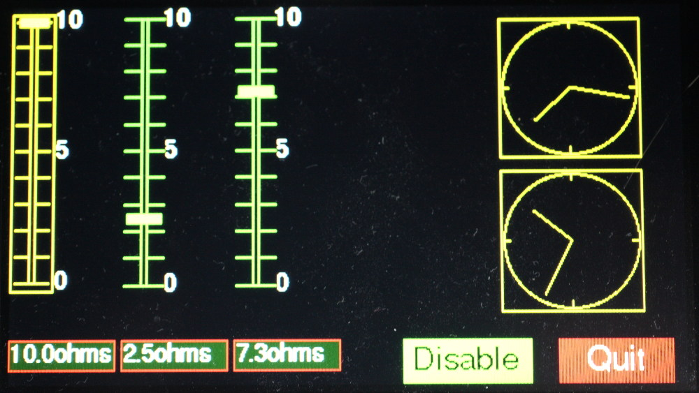

# Sample Images

These are based on the 4.3 inch display. Color rendition in these images is not
particularly good: in practice colors are clear and vibrant.

###### [GUI docs](./GUI.md)

# Puhbuttons

# Vertical sliders

# Horizontal sliders

Widget colors can change dynamically.

# Rotary controls, dropdown lists and listboxes

# Text boxes: word wrap and tab stops

These support scrolling programmatically or via touch.

# Vector display

Vectors (as a `complex`) may be shown in "compass" or "clock" styles. Length
and angle change as the vector alters. The color of any vector can be changed
dynamically in uer code.

# Scale

The `Scale` control can accurately display variables having a wide range of
values. The scale moves within a window so that the current value aligns with
the fixed pointer. The scale color can change dynamically (in the lower
instance).

# Modal Dialog Box

# Plot Module

These images were a proof-of-concept of using the Pyboard to generate a sine
wave and using the ADC's to read the response of the network under test.

## Control Panel

## Bode Plot (Cartesian graph)

## Nyquist Plot (Polar graph)

The above plots were from a proof of concept for my
[electrical network analyser](https://forum.micropython.org/viewtopic.php?f=5&t=4159).
Plotting these graphs used a lash-up with the network (a two pole passive
filter) wired between a DAC output and an ADC input. The real instrument
benefits from a variable gain amplifier for much improved dynamic range. The
ADC `read_timed_multi` method now enables gain and phase to be measured much
more accurately and at higher signal frequencies.
